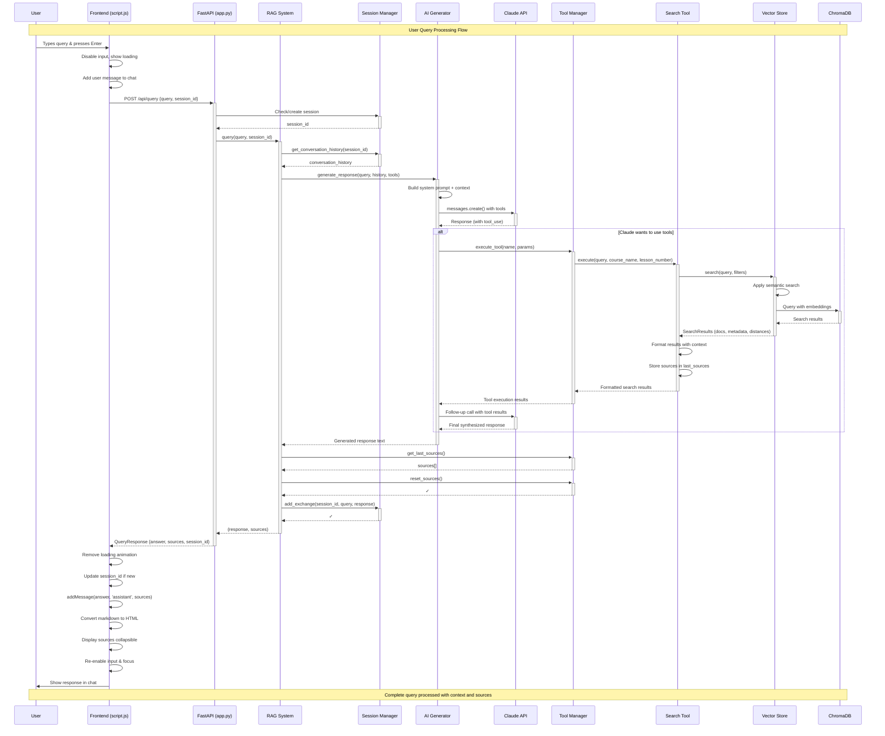
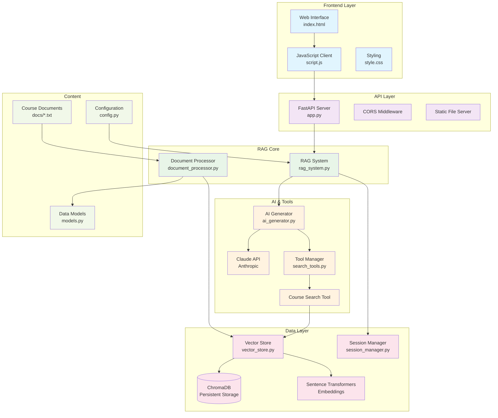

# RAG System Query Flow Diagram



## Architecture Overview



## Key Data Structures

```mermaid
graph LR
    subgraph "Request/Response Models"
        QReq[QueryRequest<br/>- query: str<br/>- session_id: Optional[str]]
        QResp[QueryResponse<br/>- answer: str<br/>- sources: List[str]<br/>- session_id: str]
    end
    
    subgraph "Core Data Models"
        Course[Course<br/>- id: str<br/>- title: str<br/>- description: str<br/>- lessons: List[Lesson]]
        Lesson[Lesson<br/>- number: int<br/>- title: str<br/>- content: str]
        Chunk[CourseChunk<br/>- course_id: str<br/>- lesson_number: int<br/>- content: str<br/>- metadata: Dict]
    end
    
    subgraph "Search Results"
        SResults[SearchResults<br/>- documents: List[str]<br/>- metadata: List[Dict]<br/>- distances: List[float]<br/>- error: Optional[str]]
    end
    
    Course --> Lesson
    Lesson --> Chunk
    Chunk --> SResults
    QReq --> QResp
```